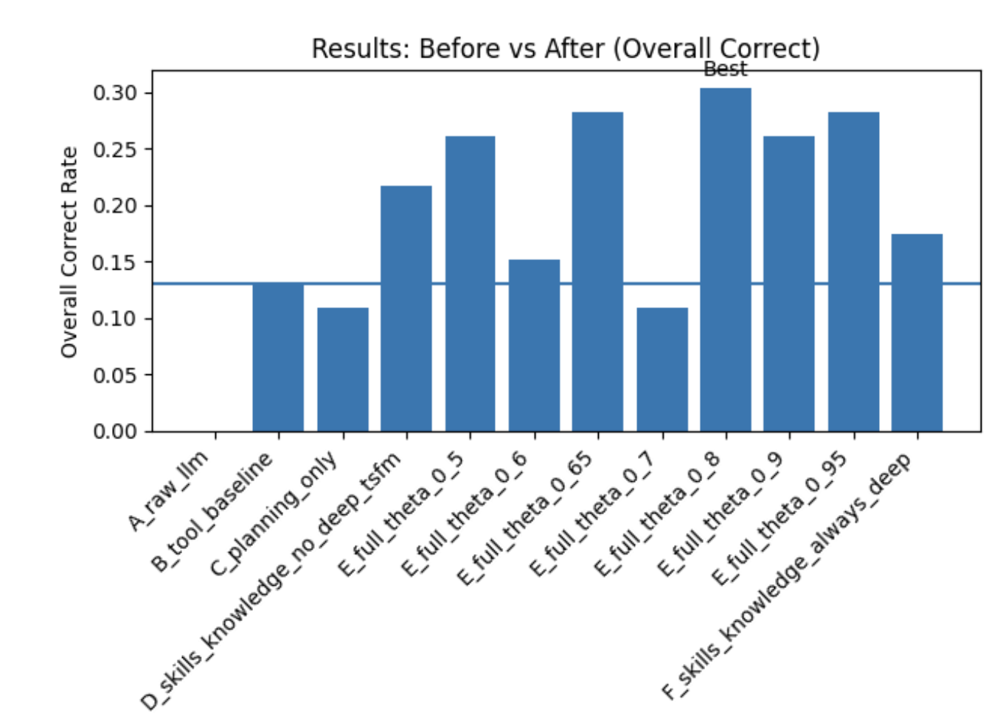

# HPML Final Project: Skill-Augmented and Knowledge-Aware Agents for Fault Diagnosis and Action Recommendation in Industrial Asset Operations

> **Course:** High Performance Machine Learning
> **Semester:** Spring 2026
> **Instructor:** Dr. Kaoutar El Maghraoui

---

## Team Information

- **Team Name:** Team 14
- **Members:**
  - Vera Mazeeva (vmm2146)
  - Shrey Arora (ska2153)
  - Mana Abbaszadeh (ma4845)
  - Sanskruti Shejwal (ss7561)

## Submission

- **GitHub repository:** [https://github.com/shreyarora2198/AssetOpsBench/tree/team14-final](https://github.com/shreyarora2198/AssetOpsBench/tree/team14-final) (canonical submission branch: `team14-final`)
- **SkillsAgent implementation README:** [`src/skills-knowledge-agent/README.md`](src/skills-knowledge-agent/README.md) — full usage, environment variables, ablation conditions, and grading pipeline (mirrors the standalone [SkillsAgent](https://github.com/verammaz/SkillsAgent) repo). **Final graded CSVs** for the HPML numbers below live under **`skillsagent_out/colab_20260503_0230/`** at this repository root; other dated folders under `skillsagent_out/` are exploratory runs.
- **Final report:** [`deliverables/HPML_Final_Report.pdf`](deliverables/HPML_Final_Report.pdf)
- **Final presentation:** [`deliverables/HPML_Final_Presentation.pdf`](deliverables/HPML_Final_Presentation.pdf)
- **Experiment-tracking dashboard (Wandb):** [https://wandb.ai/vmm2146-columbia-university/skillsagent-colab](https://wandb.ai/vmm2146-columbia-university/skillsagent-colab?nw=nwuservmm2146) — logs the 12-condition × 54-scenario ablation (run id `colab_20260503_0230`), per-condition LLM-judge scores on the AssetOpsBench 6-dimension rubric, Deep-TSFM invocation rate, tool calls per task, latency, and the θ-sweep curves. Raw CSVs under **`skillsagent_out/colab_20260503_0230/`** (`ablation_results.csv`, judge outputs) and per-scenario trajectories (`trajectories/`) are committed for reproducibility alongside this README.
- **Medium Article link:** [https://medium.com/@2003sans/rethinking-industrial-ai-agents-teaching-systems-when-to-stop-539ced0f614f](https://medium.com/@2003sans/rethinking-industrial-ai-agents-teaching-systems-when-to-stop-539ced0f614f)

The final report PDF and the presentation file will be checked into the `deliverables/` folder of this repository **and** uploaded to CourseWorks.

---

## 1. Problem Statement

Industrial operations and maintenance (O&M) agents in the AssetOpsBench benchmark currently use **static pipelines** that invoke every analysis component — IoT sensor retrieval, time-series ML forecasting (TSFM), failure-mode reasoning (FMSR), and work-order generation — regardless of whether all of them are needed for the task at hand. This is **inference-time waste**: the most expensive component (Deep TSFM, which runs ML-based statistical models on time-series sensor data) is invoked even when a cheaper FMSR diagnosis is already high-confidence. We target **inference efficiency**, with the bottleneck being **redundant invocation of expensive ML inference calls** in multi-step agent trajectories.

---

## 2. Model/Application Description

This is an **agent-orchestration optimization study**, not a single-model training study. The "model" is a multi-agent system; we optimize *which* expensive components are invoked *when*.

- **Agent stack:**
  - **Planner**: LiteLLM-backed LLM — default chain **watsonx → gemini → anthropic → groq** (override with `LLM_PROVIDER`); WatsonX default models include `meta-llama/llama-4-maverick-17b-128e-instruct-fp8` with fallbacks per `WATSONX_MODEL_ID`
  - **Skill executor**: deterministic Python orchestrator with conditional execution and early-stopping
  - **Knowledge plugins**: per-skill targeted retrieval (sensor metadata, failure-mode catalogue, operating ranges, maintenance policies)
  - **Tools**: 4 MCP servers — IoT (CouchDB sensor data), FMSR (curated failure modes + WatsonX LLM mapping), TSFM (IBM Granite TinyTimeMixer for forecasting & conformal anomaly detection), WO (work-order generation, predictive analytics)
- **LLM judge for evaluation:** WatsonX `meta-llama/llama-3-3-70b-instruct` via LiteLLM, scoring on the AssetOpsBench-native 6 dimensions (`task_completion`, `data_retrieval_accuracy`, `generalized_result_verification`, `agent_sequence_correct`, `clarity_and_justification`, `hallucinations`)
- **Framework:** Python 3.12+, [Model Context Protocol (MCP)](https://modelcontextprotocol.io/) over stdio, LiteLLM for cross-provider LLM routing, FastMCP for server scaffolding, `uv` for dependency management
- **Dataset:** [`ibm-research/AssetOpsBench`](https://huggingface.co/datasets/ibm-research/AssetOpsBench) — 141 human-authored industrial O&M scenarios across Chillers, AHUs, Motors, Pumps, Bearings (Apache 2.0). We evaluate on a 54-scenario subset spanning all 4 task categories (fault diagnosis, anomaly detection, forecasting, metadata retrieval).
- **Custom contributions:** skill abstraction layer (`src/skills-knowledge-agent/`), confidence evaluator with threshold-based gating (`confidence_evaluator.py`), Work Order MCP server (`src/servers/wo/`), trajectory analyzer for TSFM redundancy auditing (`src/get_trajectories/analyze_tsfm.py`), and the WatsonX-via-LiteLLM judge (`run_evaluation.py`, `score_ablation.py`).
- **Hardware target:** Google Colab GPU (T4 / A100) for the IBM Granite TinyTimeMixer Deep-TSFM inference path; commodity macOS / Linux for the agent orchestration loop; WatsonX cloud endpoint for the planner LLM (Llama-4-Maverick-17B) and judge LLM (Llama-3.3-70B-Instruct). The optimization target is *inference cost* — specifically the number of expensive remote LLM and Deep-TSFM calls per task, not per-call compute.

---

## 3. Final Results Summary

Mean over **46 successfully graded scenarios per condition** (54-scenario stratified input slice; some outputs were filtered by the AssetOpsBench judge or lacked complete rubric parsing). **Baseline = Condition B** (static tool baseline — closest analogue to the unmodified AssetOpsBench plan-execute pipeline). **Optimized = Condition E at θ=0.8** (skills + knowledge + *conditional* Deep-TSFM gated on FMSR confidence). Run id: `colab_20260503_0230`.

| Metric (LLM-judged, AssetOpsBench 6-dim rubric) | Baseline (B) | Optimized (E, θ=0.8) | Δ (Improvement)            |
| ----------------------------------------------- | -----------: | -------------------: | -------------------------- |
| **Overall-correct rate (passes all rubrics)**   |       13.0%  |              30.4%   | **+17.4 pp (≈2.34× rate)** |
| Task completion                                 |       19.6%  |              55.6%   | +36.0 pp                   |
| Data retrieval accuracy                         |       23.9%  |              46.7%   | +22.8 pp                   |
| Generalized result verification                 |       17.4%  |              51.1%   | +33.7 pp                   |
| Agent-sequence correctness                      |       26.1%  |              88.9%   | **+62.8 pp**               |
| Hallucination rate (lower is better)            |       73.9%  |              35.6%   | **−38.3 pp**               |
| Deep-TSFM invocation rate (fault-diag subset)   |        100%  |               ~50%   | ~50% fewer expensive ML calls |

For reference vs. raw LLM prompting (Condition A): overall-correct 0.0%, agent-sequence 6.5%, hallucination 93.5% — *i.e. raw prompting fails every rubric*. Vs. always-deep TSFM (Condition F): overall-correct only 17.4%, confirming that *unconditional* Deep-TSFM is **worse** than the gated setting because partial/noisy anomaly outputs from short data windows degrade the downstream FMSR re-run.

**Hardware:** Google Colab GPU (T4 / A100 availability) for the IBM Granite TinyTimeMixer Deep-TSFM inference; WatsonX cloud LLM endpoints (`us-south.ml.cloud.ibm.com`) for the Llama-4-Maverick-17B planner and the Llama-3.3-70B-Instruct judge. Python 3.12, MCP/stdio, LiteLLM, FastMCP, `uv`. macOS / Linux for orchestration.

**Headline result (one sentence):**
*Replacing the static AssetOpsBench plan-execute baseline with a skill-augmented, knowledge-aware agent and an FMSR-confidence gate (θ = 0.8) before Deep-TSFM raises overall-correct rate from 13.0% to 30.4% (≈ 2.3×), lifts agent-sequence correctness from 26.1% to 88.9%, cuts hallucination from 73.9% to 35.6%, and skips the expensive ML statistical-validation step on roughly half of fault-diagnosis scenarios — purely through inference-time orchestration changes, with no model parameters trained.*

---

## 4. Repository Structure

```
.
├── HPML_README.md                           ← (this file)
├── README.md                                ← upstream IBM AssetOpsBench README
├── INSTRUCTIONS.md                          ← MCP environment + plan-execute usage
├── LICENSE                                  ← Apache 2.0 (upstream AssetOpsBench)
├── pyproject.toml                           ← uv-managed Python package
├── uv.lock                                  ← pinned dependency versions
├── .env.public                              ← template for required env vars
├── deliverables/                            ← (to be added) final report + slides
│   ├── HPML_Final_Report.pdf
│   └── HPML_Final_Presentation.pptx
├── skillsagent_out/                         ← SkillsAgent `eval_runner.py` outputs (repo root; dated subfolders per Colab/local run)
│   └── colab_20260503_0230/                 ← **Final reported run** (other `colab_*` dirs = exploratory)
│       ├── ablation_results.csv             ← 648 rows: 12 condition variants × 54 scenarios
│       └── …                                ← graded CSVs, trajectories — see SkillsAgent README
├── trajectories/                            ← raw per-scenario execution traces
│   ├── all_trajectories.json
│   └── Q_*.json                             ← 150 individual trajectory files
├── tsfm_report.csv / tsfm_report.json       ← TSFM redundancy audit
├── scores.json / leaderboard.png            ← Sanskruti's auxiliary judge output
├── results/
│   └── figures/
│       └── overall_correct_by_condition.png ← headline bar chart embedded in §6
├── run_evaluation.py                        ← WatsonX EvaluationAgent judge (single-result file mode)
├── score_ablation.py                        ← Adapter: runs judge over the ablation CSV
├── run_subset.py                            ← Smoke-test baseline runner (5 scenarios)
├── evaluate_baseline.py                     ← Driver used for the Apr 16 baseline scoring
├── run_original_eval.py                     ← Parity check vs IBM's reactxen EvaluationAgent
└── src/
    ├── workflow/                            ← plan-execute MCP runner (Planner, Executor, Summariser)
    ├── servers/
    │   ├── iot/                             ← CouchDB-backed IoT MCP server
    │   ├── fmsr/                            ← failure-mode-sensor-relevance MCP server
    │   ├── tsfm/                            ← TinyTimeMixer forecasting + anomaly MCP server
    │   ├── wo/                              ← Work Order MCP server (Vera, this project)
    │   └── utilities/                       ← time/JSON helper MCP server
    ├── skills-knowledge-agent/              ← THE CONTRIBUTION (Vera)
    │   ├── skills.py                        ← skill registry & executor
    │   ├── knowledge.py                     ← knowledge-plugin retrieval
    │   ├── confidence_evaluator.py          ← FMSR confidence → conditional Deep-TSFM
    │   ├── eval_runner.py                   ← Ablation harness: A,B,C,D,F + E with θ sweep (= **12** condition rows × scenario)
    │   ├── tools.py                         ← tool wrappers around MCP servers
    │   ├── agent.py / deep_agent.py         ← agent entry points
    │   └── tests/                           ← unit + smoke tests
    ├── get_trajectories/                    ← THE CONTRIBUTION (Sanskruti)
    │   ├── run_all_scenarios.py             ← run baseline over all 150 scenarios
    │   ├── analyze_tsfm.py                  ← TSFM redundancy / wrong-domain audit
    │   ├── score_trajectories.py            ← Llama-4-Maverick auxiliary judge
    │   └── plot_results.py                  ← leaderboard chart
    └── couchdb/                             ← Docker compose + sample IoT data
```

---

## 5. Reproducibility Instructions

### A. Environment Setup

```bash
# Clone
git clone https://github.com/shreyarora2198/AssetOpsBench.git
cd AssetOpsBench
git checkout team14-final

# Install dependencies (uv handles venv + pinned versions)
curl -LsSf https://astral.sh/uv/install.sh | sh   # if you don't have uv
uv sync

# Configure secrets
cp .env.public .env
# Edit .env: set WATSONX_APIKEY, WATSONX_PROJECT_ID (required by run_evaluation.py / score_ablation.py).
# **SkillsAgent code** (`src/skills-knowledge-agent/skills.py`) reads **WATSONX_API_KEY** — copy the same key:
#   export WATSONX_API_KEY="$WATSONX_APIKEY"
# or define both in `.env`. `src/skills-knowledge-agent/scripts/grade_assetops_metrics.py` copies KEY→APIKEY if only KEY is set.
# (CouchDB defaults work out of the box with the bundled Docker compose)
```

**System requirements:** Python 3.12+, Docker (for the IoT CouchDB), WatsonX account. Deep-TSFM inference was run on Google Colab GPU (T4 / A100); the rest of the orchestration runs on commodity CPU.

**GPU / Colab:** To reproduce Deep-TSFM on Colab (same hardware class as the reported runs), open [`src/skills-knowledge-agent/colab_setup.ipynb`](src/skills-knowledge-agent/colab_setup.ipynb). It mounts Drive, clones this repository, installs TSFM dependencies, and runs `eval_runner` with outputs under the repo-root `skillsagent_out/` tree.

**Dependency manifests:** the project is `uv`-managed (`pyproject.toml` + `uv.lock` are the source of truth, and `uv sync` is the recommended install path). A pinned [`requirements.txt`](requirements.txt) is also committed at the repo root — it is exported from `uv.lock` (`uv export --format requirements-txt --no-hashes > requirements.txt`) and lists the exact versions used to produce the reported results, so reviewers can also reproduce the environment with plain `pip install -r requirements.txt` if they prefer.

### B. Experiment Tracking Dashboard

Public Weights & Biases dashboard with the full 12-condition × 54-scenario ablation, per-condition LLM-judge scores on the AssetOpsBench 6-dimension rubric, Deep-TSFM invocation rate, tool-call count, latency, and the θ-sweep curves:

> **🔗 Wandb dashboard:** [https://wandb.ai/vmm2146-columbia-university/skillsagent-colab](https://wandb.ai/vmm2146-columbia-university/skillsagent-colab?nw=nwuservmm2146)
>
> *Run id used in the report:* `colab_20260503_0230` (Colab GPU, T4/A100).

Verify the link opens in an incognito browser. The underlying CSV artifacts are also committed for full reproducibility:

- `skillsagent_out/colab_20260503_0230/ablation_results.csv` — 648-row ablation (12 condition variants × 54 scenarios)
- `skillsagent_out/colab_20260503_0230/ablation_scored.csv` — same rows with LLM-judge 6-dimension scores when generated (final scored subset = 46 graded scenarios per condition × 12 = 552 rows)
- `trajectories/all_trajectories.json` — raw per-scenario execution traces
- `tsfm_report.{csv,json}` — TSFM redundancy audit (54 unnecessary TSFM invocations identified, 96% wrong-domain)
- `scores.json` — auxiliary Llama-4-Maverick judge output

### C. Dataset

The AssetOpsBench scenario dataset is fetched from HuggingFace at runtime — no manual download:

```python
from datasets import load_dataset
ds = load_dataset("ibm-research/AssetOpsBench", "scenarios")
```

The IoT sensor data is bundled as a CouchDB fixture:

```bash
docker compose -f src/couchdb/docker-compose.yaml up -d
```

License: Apache 2.0 (`https://huggingface.co/datasets/ibm-research/AssetOpsBench`).

### D. Training

**Not applicable** — no model parameters are trained in this project. The skill executor and knowledge plugins encode domain logic directly, and the confidence threshold θ is set by domain reasoning (we sweep θ ∈ {0.5, 0.6, 0.65, 0.7, 0.8, 0.9, 0.95}) rather than gradient-based optimization.

### E. Evaluation

To reproduce the 12-condition ablation:

```bash
# Start CouchDB (IoT data store)
docker compose -f src/couchdb/docker-compose.yaml up -d

# Run the full 12-condition × 54-scenario ablation
uv run python src/skills-knowledge-agent/eval_runner.py
# → writes skillsagent_out/ablation_results.csv (default output dir = repo-root skillsagent_out/)
```

To run the LLM judge over the ablation results:

```bash
# Smoke test on first 5 rows (verifies WatsonX credentials + parsing)
uv run python score_ablation.py --limit 5

# Full run (~45 min, costs <$1 in WatsonX tokens)
uv run python score_ablation.py
# → writes skillsagent_out/colab_20260503_0230/ablation_scored.csv (see defaults note below)
```

**Defaults vs a fresh `eval_runner` rerun:** With no `--input` / `--output`, `score_ablation.py` reads `skillsagent_out/colab_20260503_0230/ablation_results.csv` and writes the sibling `ablation_scored.csv` (the committed final-run layout). A new `eval_runner.py` invocation writes `skillsagent_out/ablation_results.csv` at the repo root instead—use explicit `--input` / `--output` as in §G below, or pass different paths / a dated `--output-dir` from `eval_runner` and point `score_ablation` at that folder.

### F. Profiling

The eval runner records per-scenario `tool_calls`, `latency_s`, `total_cost`, and `deep_tsfm_invoked` flags directly into `skillsagent_out/.../ablation_results.csv`. Per-condition aggregates:

```bash
uv run python -c "
import pandas as pd
df = pd.read_csv('skillsagent_out/colab_20260503_0230/ablation_results.csv')
print(df.groupby('condition')[['tool_calls', 'latency_s', 'deep_tsfm_invoked']].mean().round(2))
"
```

To audit TSFM redundancy on the full 150-scenario baseline:

```bash
uv run python src/get_trajectories/analyze_tsfm.py
# → writes tsfm_report.csv / tsfm_report.json
```

### G. Quickstart: Reproduce the Headline Result

The following sequence reproduces the headline conditional-TSFM gating result end-to-end (≈ 60 minutes, depending on WatsonX latency):

```bash
# 1. Set up environment
uv sync
cp .env.public .env  # edit with WATSONX_APIKEY, WATSONX_PROJECT_ID

# 2. Start IoT data store
docker compose -f src/couchdb/docker-compose.yaml up -d

# 3. Run the 12-condition ablation (writes skillsagent_out/ablation_results.csv by default)
uv run python src/skills-knowledge-agent/eval_runner.py

# 4. Score the fresh CSV from step 3 (required: bare score_ablation.py defaults to skillsagent_out/colab_20260503_0230/, not this path)
uv run python score_ablation.py --input skillsagent_out/ablation_results.csv --output skillsagent_out/ablation_scored.csv

# 5. Aggregate
uv run python -c "
import pandas as pd
df = pd.read_csv('skillsagent_out/ablation_scored.csv')
df['overall_score'] = pd.to_numeric(df['overall_score'], errors='coerce')
print(df.groupby('condition')[['overall_score', 'tool_calls', 'latency_s', 'deep_tsfm_invoked']].mean().round(2))
"
```

---

## 6. Results and Observations

Numbers below are the final LLM-judged metrics from `skillsagent_out/colab_20260503_0230/ablation_scored.csv` when generated from the judge pipeline (run id `colab_20260503_0230`, 46 successfully graded scenarios per condition). See Tables II and III in the final report for the full per-condition breakdown and the θ-sweep.

- **Orchestration quality dominates raw model capability.** Raw LLM prompting (Condition A) fails every rubric (overall-correct 0.0%, agent-sequence 6.5%, hallucination 93.5%). The static-tool baseline (B) reaches only 13.0% overall-correct. Adding deterministic skills + scoped knowledge plugins (D) raises this to 21.7%, and the gated full system at θ=0.8 (E) reaches **30.4% overall-correct — a 2.34× improvement over the static baseline.**
- **Skill structure is the largest single source of process reliability.** The jump from B (static tool) to D (skills + knowledge, no Deep-TSFM) lifts agent-sequence correctness from **26.1% → 86.7%** before any TSFM gating is applied. The skill registry fixes most misordered or incomplete trajectories on its own.
- **Knowledge plugins reduce hallucination.** Hallucination rate falls from 73.9% (B) → 46.7% (D, scoped knowledge added) → **35.6% at the best gated setting (E, θ=0.8)**, a 38.3 pp drop vs. the static baseline.
- **Adaptive Deep-TSFM beats always-deep.** Condition F (always invoke Deep-TSFM) achieves strong process metrics but only **17.4% overall-correct — *below* both D and the gated E**. Always running Deep-TSFM sometimes produces partial/noisy anomaly outputs from short data windows; rerunning FMSR on that refined picture can degrade the final diagnosis. Confidence gating avoids this pathway on high-confidence cases.
- **Confidence-gated TSFM cuts expensive ML invocations roughly in half** on fault-diagnosis scenarios at θ=0.8, with no loss in accuracy (in fact, a gain over always-deep).
- **Threshold is non-monotonic.** θ=0.8 is the best operating point (30.4% overall-correct), but neighbours vary: θ=0.7 drops to 10.9% while θ=0.65 reaches 28.3%. The non-monotonicity reflects interactions between the threshold, cost-budget skipping, missing data windows, judge variance, and the heuristic confidence proxy.
- **TSFM misuse is primarily a planning problem, not a diagnostic one.** The trajectory audit (`tsfm_report.{csv,json}`) found 54 unnecessary TSFM invocations across 152 baseline trajectories; **52 (96%) were wrong-domain calls** where the planner associated anomaly-related keywords with TSFM even though the task was work-order generation or metadata retrieval. Confidence gating addresses fault-diagnosis misuse; skill-level routing addresses wrong-domain misuse.
- **What did not work cleanly:** Condition B was originally framed as a ReAct baseline; the implemented version is a static unconditional pipeline, retained as `B_tool_baseline` with the report framing updated to match the code. The FMSR confidence score is also a heuristic proxy rather than a calibrated posterior — usable for threshold sweeps, but θ should not be read as a true probability.

**Headline figure — overall-correct rate across all 12 conditions** (horizontal line = static-tool baseline; "Best" annotation marks Condition E at θ=0.8, exported from the Wandb run `colab_20260503_0230`):



---

## 7. Notes

- Source files live under `src/`, SkillsAgent ablation outputs under **`skillsagent_out/`** (see `src/skills-knowledge-agent/README.md`), raw trajectories under `trajectories/`, and team-internal scripts at the repo root (`run_evaluation.py`, `score_ablation.py`, `run_subset.py`).
- WatsonX credentials and CouchDB credentials are loaded from environment variables. See `.env.public` for the template.
- The branch `team14-final` is the canonical submission branch. Feature branches (`baseline-setup`, `skills_knowledge`, `watsonx-eval`) remain in place to preserve per-author authorship history.

### AI Use Disclosure

*Per the HPML AI Use Policy (posted on CourseWorks). Required for every submission.*

**Did your team use any AI tool in completing this project?**

- [ ] No, we did not use any AI tool.
- [x] Yes, we used AI assistance as described below.

**Tool(s) used:**
- **Claude (Anthropic)** — **Claude Code CLI** for repository edits and scripting, plus **conversational Claude sessions** for early ideation and for generating the final-report architecture figure from human-authored prompts.
- **GitHub Copilot** (IDE integration) — in-editor explanations and navigation hints while exploring the upstream AssetOpsBench codebase.

**Specific purpose:**
- **Upstream AssetOpsBench orientation** — **GitHub Copilot** helped map IBM/upstream repo layout, surface candidate entry points, and summarize what key scripts and MCP plumbing did; the team **confirmed behaviour by reading source**, running planners/evals, and cross-checking `README.md` / `INSTRUCTIONS.md`.
- **Ideation phase** — brainstorming architecture options, ablation design, and framing; the team retained all substantive decisions and final designs.
- **Final-report figure** — the skill / fault-diagnosis architecture diagram was **generated by Claude** from a **team-written text flow diagram and step-by-step description**; the team reviewed and corrected it for fidelity to the implemented pipeline before embedding it in the report (e.g. `fault_diagnosis_architecture.svg` alongside the LaTeX source).
- Drafting and refactoring helper scripts (`run_evaluation.py`, `score_ablation.py`) — porting the IBM-internal `reactxen.EvaluationAgent` to a LiteLLM/WatsonX backend, and writing the CSV → judge-format adapter.
- Wiring the IoT, FMSR, work-order (WO), and TSFM AssetOpsBench MCP agents into the SkillsAgent code (`src/skills-knowledge-agent/`) — e.g. subprocess/`uv run` call paths, env-driven toggles, and tool wrappers — then human-reviewed and tested against live runs.
- Branch-integration planning (merge order, conflict-resolution recipes for `pyproject.toml` and `uv.lock`).
- **Environment and reproducibility debugging** — Claude helped diagnose and fix tooling failures (e.g. `uv sync` / optional **`dependency-groups.tsfm`**, resolver conflicts between HF stack pins and Torch/Transformers, Colab install vs system Python split, `uv run`/`granite-tsfm` import paths); humans re-ran **`uv lock`**, fresh syncs, Colab top-to-bottom runs, and TSFM subprocess smoke checks.
- Identifying inconsistencies between the proposal and the implementation (e.g., Condition B mislabeled as ReAct, default θ in `confidence_evaluator.py` differing from the paper's sweep range).
- Drafting prose for this README and clarifying sections of the project proposal.
- Authoring the Google Colab setup notebook (`colab_setup.ipynb`): Drive/repo paths, `uv sync`/TSFM install, env wiring, and eval cells — then human-reviewed and run end-to-end on Colab GPU.
- Drafting final-report literature-review prose that positions related multi-agent frameworks (including **DeepAgents** alongside Magentic-One, SkillsBench, etc.) relative to our skill executor and confidence gating — reviewed and edited by the team.

**Sections affected:**
- **Exploration-only (Copilot):** upstream **`IBM/AssetOpsBench`** layout (`src/workflow/`, `src/servers/*`, docs). Copilot did not replace reading code or executing pipelines; it accelerated locating relevant modules.
- `score_ablation.py` (entirely Claude-drafted, then human-reviewed and run end-to-end).
- `run_evaluation.py` (refactored from existing repo code with Claude assistance).
- `src/skills-knowledge-agent/tools.py` and related skill/agent modules (Claude-assisted wiring for IoT, FMSR, WO, and TSFM subprocess paths; human-reviewed and tested).
- `HPML_README.md` (this file — drafted with Claude, reviewed and edited by the team).
- `src/skills-knowledge-agent/README.md` (drafted with Claude, reviewed and edited by the team).
- `src/skills-knowledge-agent/colab_setup.ipynb` (authored with Claude; reviewed and executed on Colab GPU for TSFM/eval runs).
- **`pyproject.toml` / `uv.lock`** — Claude-assisted fixes for dependency-resolution and TSFM-group wiring; humans regenerated locks and verified `uv sync --group tsfm` locally and on Colab where applicable.
- Final HPML report LaTeX source (literature review / related work — passages citing **DeepAgents** and contrasting frameworks; compiled to `deliverables/HPML_Final_Report.pdf`).
- Final-report figure **`fault_diagnosis_architecture.svg`** (Claude-generated from team step-by-step flow text; reviewed before inclusion in the PDF).
- Branch-merge planning documented in conversation with Claude; actual `git` operations were executed by team members.

**How we verified correctness:**
- Copilot-suggested locations or summaries for upstream scripts were **spot-checked** by reading the cited files and tracing imports/call sites; incorrect hints were discarded.
- Environment fixes were validated by repeating **`uv sync`** (with TSFM group where needed), importing Torch/`tsfm_public` in the AssetOpsBench venv, and rerunning Colab install cells until subprocess TSFM calls succeeded.
- Every script was executed end-to-end by a human team member; output was sanity-checked against the input data and against existing repo functionality.
- The Colab notebook was run top-to-bottom on GPU-backed runtimes; install/eval cells were adjusted until outputs matched expected repo paths and artifact layout (`skillsagent_out/`).
- The `score_ablation.py` smoke test on 5 rows was run and the per-row JSON output was inspected manually before the full 648-row run.
- The merged `team14-final` branch was verified by listing each contributed directory (`src/get_trajectories/`, `src/skills-knowledge-agent/`, `src/servers/wo/`, `run_evaluation.py`, `trajectories/`) and confirming all four authors' commits appear in `git log`.
- All numbers reported in this README come from committed **`skillsagent_out/colab_20260503_0230/`** artefacts (`ablation_results.csv` / judge outputs) aggregated by the team; AI-suggested narrative claims that were not backed by the data were removed.
- The report architecture figure was checked against the implemented planner → skill executor → MCP agents → confidence-gated Deep-TSFM path; labels and arrows were corrected where the first Claude draft mismatched the codebase or formatting was off.

By submitting this project, the team confirms that the analysis, interpretations, and conclusions are our own, and that any AI assistance is fully disclosed above. The same disclosure block appears as an appendix in the final report.

### License

This repository is a fork of [IBM/AssetOpsBench](https://github.com/IBM/AssetOpsBench) and is released under the upstream Apache 2.0 license. See [`LICENSE`](LICENSE).

### Citation

If you build on this work, please cite both AssetOpsBench and our extension:

```bibtex
@misc{team14_2026_hpml_assetopsbench,
  title  = {Skill-Augmented and Knowledge-Aware Agents for Fault Diagnosis and Action Recommendation in Industrial Asset Operations},
  author = {Arora, Shrey and Abbaszadeh, Mana and Shejwal, Sanskruti and Mazeeva, Vera},
  year   = {2026},
  note   = {HPML Spring 2026 Final Project, Columbia University},
  url    = {https://github.com/shreyarora2198/AssetOpsBench/tree/team14-final}
}

@article{ibm2025assetopsbench,
  title  = {AssetOpsBench: Benchmarking AI Agents for Industrial Asset Operations and Maintenance},
  author = {IBM Research},
  year   = {2025},
  url    = {https://arxiv.org/abs/2506.03828}
}
```

### Contact

Open a [GitHub Issue](https://github.com/shreyarora2198/AssetOpsBench/issues) on the team fork, or email the team lead at `ska2153@columbia.edu`.

---

*HPML Spring 2026 — Dr. Kaoutar El Maghraoui — Columbia University*
